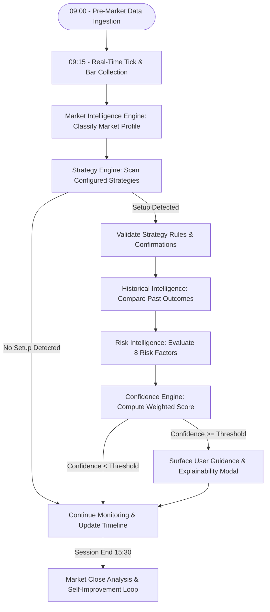
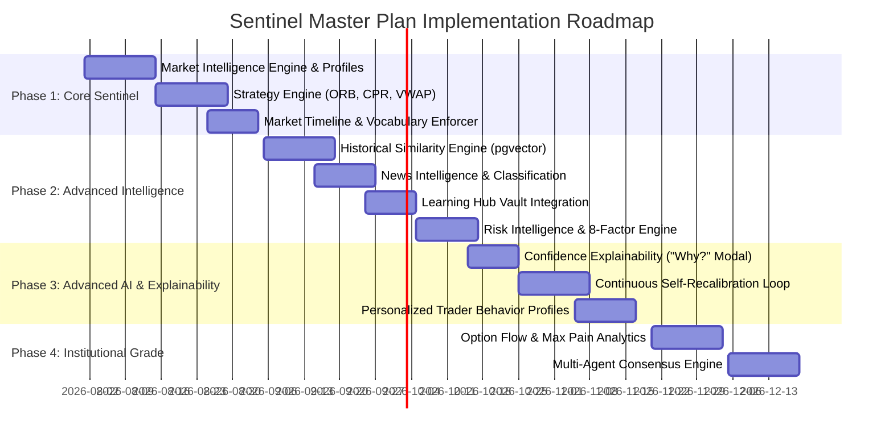

# SENTINEL MASTER PLAN — Product Vision & Intelligence Blueprint

**Document Class:** Flagship Product Vision & Architectural Blueprint  
**System:** TradeW Sentinel (Market Intelligence Companion)  
**Author:** Product Architect & Lead AI Systems Engineer  
**Status:** Canonical Product Vision & Implementation Spec

---

## 1. Vision & Mission

### 1.1 Vision Statement

> **Sentinel is an AI-powered Market Intelligence Companion that continuously observes the market, validates trading opportunities using predefined strategies, historical performance, live market conditions, news, and trader context, then delivers timely, high-confidence guidance that helps traders make better decisions without executing trades on their behalf.**

### 1.2 Core Mission

> **Reduce bad decisions instead of increasing the number of trades.**

Sentinel is designed around a fundamental reality of financial markets: profitability comes from discipline, risk management, and patience, not over-trading. Sentinel acts as a calm, objective, analytical desk-head sitting beside the trader—filtering out market noise, detecting structural setups, warning against psychological traps, and explaining the evidence behind every observation.

---

## 2. Non-Negotiable Product Principles

Sentinel operates under seven strict product rules that govern every calculation, prompt, output, and user interaction:

1. **Never Force a Trade:** If market conditions are choppy, noisy, or low-confidence, Sentinel remains silent. Silence is a valid and high-value feature.
2. **Never Predict:** Sentinel does not forecast where the market will be in 30 minutes. It evaluates *present evidence* against historical patterns and statistical probabilities.
3. **Confidence First:** No message, signal, or guidance is ever surfaced to the user unless it clears the publication gate. **As implemented** (`services/sentinel/src/orchestrator/publication-gate.ts`) this is no longer a single fixed threshold: the old ≥85% number was replaced by a four-condition gate — (1) adaptive confidence ≥ `PUBLICATION_CONFIDENCE_THRESHOLD` (**70**), (2) every mandatory confirmation the strategy defines has validated, (3) no conflicting evidence is present, and (4) corroboration across reasoning modules is satisfied (`MIN_CORROBORATING_SOURCES = 2`). Confidence alone was letting a corroborated safety signal be trapped behind, or a lone high-confidence read published without support. Low-confidence noise is still discarded.
4. **Every Message Must Explain WHY:** Sentinel never outputs unbacked assertions like "Bullish". Every message must present structured, verifiable evidence (strategy match, volume confirmation, VWAP hold, historical success rate, news alignment).
5. **Continuous Observation:** Sentinel observes tick-by-tick and bar-by-bar throughout the entire trading session (09:15 to 15:30 IST), building a continuous session narrative rather than emitting isolated spikes.
6. **Non-Directive Output:** Sentinel strictly complies with the TradeW Constitution (`TRADEW-OS.md` §1). It never emits direct financial directives (`BUY`, `SELL`, `EXIT`, `TARGET`). Guidance is strictly phrased as market state observations (`"Bullish side in focus"`, `"Structure developing"`, `"Momentum weakening"`).
7. **Complete Explainability:** Every surfaced observation includes a **"Why?"** capability, allowing the user to inspect every matching strategy, indicator value, historical precedent, news impact, and confidence deduction.

---

## 3. End-to-End Sentinel Workflow



---

## 4. Architectural Modules Deep Dive

Sentinel is comprised of 12 interconnected intelligence modules:

```
┌──────────────────────────────────────────────────────────────────────────────────┐
│                             SENTINEL INTELLIGENCE CORE                           │
└──────────────────────────────────────────────────────────────────────────────────┘
  ├── 1. Market Intelligence Engine    ├── 7. Confidence Engine
  ├── 2. Strategy Engine               ├── 8. Market Timeline Engine
  ├── 3. Historical Intelligence       ├── 9. Market State Machine
  ├── 4. News Intelligence Engine      ├── 10. User Messaging & Vocabulary
  ├── 5. Learning Intelligence         ├── 11. Market Close Analysis
  └── 6. Risk Intelligence Engine      └── 12. Continuous Improvement Loop
```

---

### Module 1: Market Intelligence Engine

**Purpose:** Understand today's overall market regime and structural profile.

**Inputs Analyzed:**
- **Price Action:** Trend structure, Opening Range (ORB 15m/30m), Gap size, Higher Highs/Lower Lows.
- **Indicators:** VWAP, EMA (9/21/50/200), CPR (Central Pivot Range), RSI (14), MACD, Supertrend.
- **Market Dynamics:** Volume distribution, Advance/Decline breadth, India VIX, F&O Open Interest (OI) buildup, Option Chain PCR (Put-Call Ratio), Max Pain.

**Output Market Profiles:**
```
• Bullish Trend Day           • Bearish Trend Day
• High Volatility Range       • Low Volatility Compression
• Gap & Go                    • Gap Fill / Mean Reversion
• Inside Day                  • Outside Day / Expansion
```

---

### Module 2: Strategy Engine

**Purpose:** Detect and validate explicit user-configured or predefined trading strategies. Sentinel does not invent arbitrary setups; it monitors the trader's *own strategy handbook*.

**Supported Strategy Roster:**
1. **ORB Retest (Opening Range Breakout):** Breakout above/below 15m opening range followed by volume-supported retest.
2. **CPR Breakout / Bounce:** Price interaction with Daily/Weekly Central Pivot Range levels.
3. **VWAP Pullback:** Trend continuation entry on low-volume pullback to institutional VWAP.
4. **EMA Cross & Bounce:** Retest of moving average confluence (e.g. 9/21 EMA).
5. **Liquidity Sweep:** Identification of stop-hunting sweeps beyond key swing highs/lows.
6. **Fake Breakout / Bull & Bear Traps:** Breakout above key level that immediately fails on declining volume.
7. **ICT / Smart Money Concepts:** Order block mitigation, Fair Value Gaps (FVG), Market Structure Shifts (MSS).
8. **Wyckoff Accumulation / Distribution:** Spring/Upthrust identification in trading ranges.
9. **Custom User Strategies:** Declarative JSON/YAML strategy definitions defined by the trader.

**Strategy Configuration Structure:**
```yaml
strategy:
  id: orb-retest
  name: Opening Range Breakout Retest
  rules:
    - 15m candle closes beyond ORB high/low
    - Retest touches ORB boundary within 3 bars
    - Retest volume < Breakout volume
  invalidations:
    - Bar closes back inside ORB range
  ideal_session: '09:30-11:00'
  base_confidence_weight: 0.85
```

---

### Module 3: Historical Intelligence

**Purpose:** Answer the fundamental question: *"Have I seen this market situation before, and what happened?"*

**Functionality:**
- Compares current market conditions (profile, indicators, option chain, VIX) against Sentinel's historical database (`Candle` and `MemoryRecord` tables).
- Performs vector similarity search via `pgvector` to locate past trading sessions with similar price action and option chain dynamics.
- Computes statistical win rates and average risk-reward for the current setup based on historical precedent.

---

### Module 4: News Intelligence Engine

**Purpose:** Filter and evaluate real-time financial news, economic events, and corporate announcements.

**Inputs Captured:**
- Central Bank policy announcements (RBI, US FED).
- Economic data releases (CPI Inflation, GDP growth, IIP).
- Corporate earnings announcements and quarterly results.
- Institutional activity (FII / DII net buying/selling data).
- Breaking geopolitical and macroeconomic news.

**News Classification:**
Every news event is classified using the `NewsEventClassifier` into:
```
Impact Level:  [ High Impact  |  Medium Impact  |  Low Impact / Ignore ]
Sentiment:     [ Positive     |  Negative       |  Neutral ]
Scope:         [ Market-Wide  |  Sector-Specific |  Single-Symbol ]
```

---

### Module 5: Learning Intelligence Engine

**Purpose:** Connect TradeW's **Learning Hub** directly into Sentinel's brain.

Instead of only teaching users, **the Learning Hub teaches Sentinel**.
- Educational books, trading journals, strategy notes, and market concept definitions stored in the vault (`knowledge-base/`) are parsed into Sentinel's concept graph.
- When Sentinel provides guidance, it cites educational principles from the Learning Hub (e.g., *"Citing Chapter 4: Liquidity Sweeps in Range Markets"*), creating an integrated feedback loop between learning and trading.

---

### Module 6: Risk Intelligence Engine

**Purpose:** Evaluate 8 distinct dimensions of risk before surfacing guidance:

1. **Market Risk:** Overall market regime alignment.
2. **Trade Risk:** Distance to logical invalidation level.
3. **Position Risk:** User's current account margin utilization and position sizing.
4. **Volatility Risk:** India VIX spikes or option IV crush risk.
5. **News Risk:** High-impact economic news scheduled within 30 minutes.
6. **Emotional Risk:** Trader's session velocity, revenge trading signals, or loss streak.
7. **Liquidity Risk:** Bid-Ask spread width and order book depth.
8. **Time Risk:** Trading late in the session (e.g. after 14:45 IST) when margin square-offs occur.

---

### Module 7: Confidence Engine

**Purpose:** Synthesize all intelligence modules into a single, transparent Confidence Percentage (0–100%).

**Scoring Weight Breakdown Example:**
```
┌─────────────────────────────────────────────────────────────┐
│                    CONFIDENCE SCORE: 93.5%                  │
├───────────────────────────────────┬─────────────────────────┤
│ Metric Factor                     │ Score Contribution      │
├───────────────────────────────────┼─────────────────────────┤
│ 1. Trend & Profile Alignment      │  95 / 100               │
│ 2. Strategy Rules Match           │ 100 / 100               │
│ 3. Volume & Liquidity Support     │  91 / 100               │
│ 4. News Environment Alignment     │  82 / 100               │
│ 5. Option Chain & PCR Support     │  96 / 100               │
│ 6. Historical Similarity Match    │  93 / 100               │
│ 7. Risk Engine Score              │  89 / 100               │
└───────────────────────────────────┴─────────────────────────┘
```

**Threshold Rule:** Guidance is surfaced ONLY when it clears the publication gate — **as built**, adaptive confidence ≥ **70** *and* mandatory confirmations validated *and* no conflicting evidence *and* corroboration satisfied (see Principle #3 and `publication-gate.ts`). A trader-requested threshold can only *raise* the floor, never lower it below 70. Otherwise Sentinel remains in *"Wait and Watch"* mode. *(This section's earlier "≥ 85%, configurable" rule was the original single-number design, since superseded.)*

---

### Module 8: Market Timeline Engine

**Purpose:** Replace noisy, fragmented notifications with a continuous, chronological **Market Timeline**.

**Example Timeline Output:**
```
09:15 ── Market Open: NIFTY opens with +45pt gap. India VIX at 13.4.
09:20 ── Opening Range (ORB) still developing. Range: 24,520 - 24,565.
09:31 ── Bullish structure emerging. VWAP holding above 24,535.
09:42 ── ORB Retest forming on NIFTY 24,550 level.
09:48 ── Retest successful. Volume 1.4x above 20-period average.
09:51 ── 🟢 Bullish side in focus (Confidence: 91%).
10:14 ── Momentum strengthening. Call OI unwinding at 24,500.
10:37 ── Expected move largely completed. NIFTY approaching R2 resistance.
11:05 ── 🟡 Move complete. Transitioning to Wait and Watch.
```

---

### Module 9: Market State Machine

Sentinel always exists in exactly **one** defined state:

```
[ Pre-Market ]
      │
      ▼
[ Session Observation ] ──► [ Market Understanding ] ──► [ Strategy Detection ]
                                                                 │
                                                                 ▼
[ Back to Observation ] ◄── [ Move Complete ] ◄── [ Validation & Confidence Check ]
        ▲                                                        │
        │                                                        ▼
[ Momentum Weakening ] ◄── [ Opportunity Active ] ◄── [ Side in Focus ]
```

**State Enum Definition:**
- `PRE_MARKET`
- `OBSERVATION`
- `MARKET_UNDERSTANDING`
- `STRATEGY_DETECTION`
- `VALIDATION`
- `WAIT_AND_WATCH`
- `SIDE_IN_FOCUS`
- `OPPORTUNITY_ACTIVE`
- `MOVE_DEVELOPING`
- `MOMENTUM_WEAKENING`
- `MOVE_COMPLETE`
- `MARKET_CLOSE`

---

### Module 10: User Messages & Vocabulary Rules

Sentinel strictly adheres to a **non-directive vocabulary**. It never tells a trader what to do; it describes what the market is doing.

| Forbidden Terms (Violates SEBI/Constitution) | Allowed Sentinel Vocabulary |
|---|---|
| ❌ "BUY NIFTY NOW" | 🟢 "Bullish side in focus" |
| ❌ "SELL RELIANCE AT 2500" | 🟢 "Bearish structure developing at R1 resistance" |
| ❌ "EXIT YOUR POSITION" | 🟢 "Momentum weakening; price approaching key target" |
| ❌ "HIGH CONVICTION TRADE" | 🟢 "Confidence score: 94% based on 6 corroborating factors" |
| ❌ "NO TRADES TODAY" | 🟢 "Low confidence / Choppy regime; Wait and Watch" |

---

### Module 11: Market Close Analysis & EOD Review

After market close (15:30 IST), Sentinel generates an automated **End-Of-Day Market Summary**:
- **Market Summary:** Profile classification of today's session.
- **Detected Setups:** Summary of all strategies that triggered and their outcomes.
- **Successful vs Failed Setups:** Technical post-mortem on what worked and what failed.
- **Missed Opportunities:** Setups that met criteria while the trader was inactive.
- **News Impact Summary:** How news events influenced intraday moves.
- **Key Learning Takeaway:** Tailored educational takeaway for tomorrow's session.

---

### Module 12: Continuous Improvement & Self-Recalibration Loop

Sentinel continuously learns and improves itself through an automated daily feedback loop:

1. **Daily Strategy Backtesting:** Automatically backtests every configured strategy against the new day's 1-minute candle data.
2. **Performance Measurement:** Measures strategy win rates under current market regimes (e.g., ORB retests work well in trending markets, poorly in range markets).
3. **Confidence Weight Recalibration:** Adjusts strategy confidence weights dynamically based on recent 30-day performance.
4. **Knowledge Base Expansion:** Integrates newly added Obsidian notes and research papers into `MemoryRecord` vector storage.
5. **Guidance Alignment Tracking:** Tracks how accurately Sentinel's *"Side in Focus"* guidance aligned with subsequent 30-minute market moves to refine future scoring.

---

## 5. Core Feature Spotlight: Confidence Explainability Engine ("Why?" Inspector)

The flagship UX feature of Sentinel is **Confidence Explainability**. Whenever Sentinel displays a status such as `"Bullish side in focus (93.5%)"`, the user can click **"Why?"** to reveal a complete, transparent breakdown:

```
┌──────────────────────────────────────────────────────────────────────────────────┐
│                         SENTINEL CONFIDENCE EXPLAINER                            │
├──────────────────────────────────────────────────────────────────────────────────┤
│ Status: Bullish Side in Focus                     Overall Confidence: 93.5%      │
├──────────────────────────────────────────────────────────────────────────────────┤
│ ✅ MATCHED STRATEGIES                                                            │
│    • ORB 15m Retest (Confirmed at 09:48 IST on 1.4x volume)                      │
│    • VWAP Hold (Price 24,550 > VWAP 24,535 for 4 consecutive bars)              │
│                                                                                  │
│ 📊 CONFIRMING INDICATORS                                                         │
│    • RSI (14): 62 (Bullish momentum zone, no divergence)                         │
│    • Option Chain: Call unwinding at 24,500 (+14.2% Put OI addition)             │
│    • India VIX: 13.4 (-2.1% decline, stable volatility)                          │
│                                                                                  │
│ 📚 HISTORICAL PRECEDENT                                                          │
│    • 83% historical success rate across 47 similar ORB retests in 2026           │
│    • Last similar session: July 14, 2026 (NIFTY +140pt trend day)                │
│                                                                                  │
│ 📰 NEWS & ENVIRONMENT                                                            │
│    • Neutral/Positive global cues; no high-impact economic events scheduled      │
│                                                                                  │
│ ⚠️ CONFIDENCE DEDUCTIONS                                                         │
│    • -3.5% deducted due to minor resistance overhead at 24,580 (Daily R1)        │
│                                                                                  │
│ ⏱️ TIMING RATIONALE                                                              │
│    • Surfaced at 09:51 after 3-bar retest confirmation (Confidence crossed 85%) │
└──────────────────────────────────────────────────────────────────────────────────┘
```

This complete transparency transforms Sentinel from a black box into a trusted, educational partner.

---

## 6. Phased Product Implementation Roadmap



### Phase 1: Core Sentinel (Basic Companion)
- Market Observation Engine & 10 Market Profile Classifications.
- Core Strategy Engine (ORB Retest, CPR Breakout, VWAP Pullback, EMA Cross).
- Real-Time Market Timeline (09:15 to 15:30 IST).
- Non-Directive Vocabulary Enforcer (`"Wait and Watch"`, `"Side in Focus"`).

### Phase 2: Advanced Intelligence
- Historical Precedent Engine using `pgvector` similarity search over `Candle` bars.
- Real-Time News Intelligence & `NewsEventClassifier`.
- Learning Hub Vault Integration (`knowledge-base/` concept linking).
- 8-Factor Risk Intelligence Engine.

### Phase 3: Advanced AI & Explainability
- **Confidence Explainability Engine ("Why?" Modal).**
- Continuous Self-Improvement & Daily Recalibration Loop.
- Multi-Timeframe Confluence Reasoning.
- Personalized Trader Behavioral Risk Profiles.

### Phase 4: Institutional Grade
- Advanced Option Flow & Gamma Expiry Analytics.
- Multi-Agent Consensus Engine (Synthesizing Technical, News, Option, and Risk sub-agents).
- Cross-Asset Correlation (NIFTY vs BANKNIFTY vs US Markets vs Commodities).
