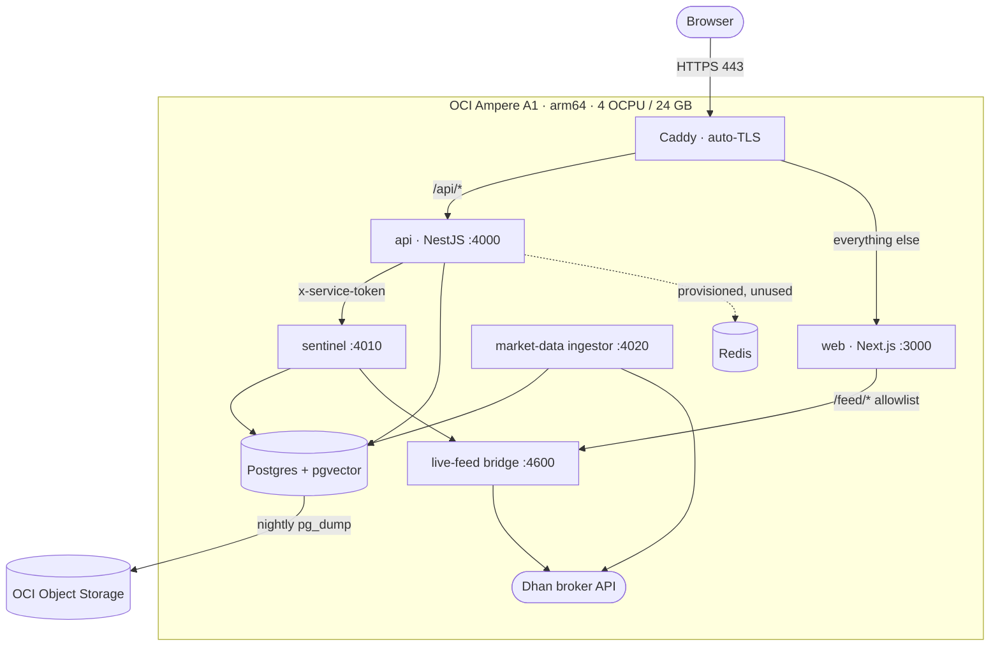
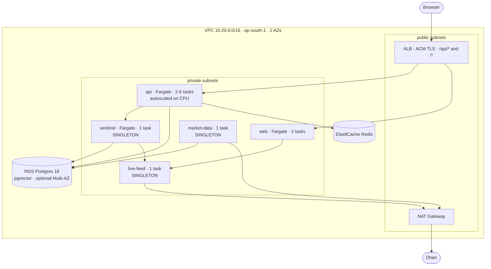

# TradeW Cloud Architecture — Staged Plan

**Date:** 2026-08-10
**Decision:** Stage 0 on Oracle Cloud Free Tier now; a defined, costed path to
AWS `ap-south-1` when there is traffic that justifies it.
**Scope:** hosting and operations only. Nothing here changes the application
architecture in `ARCHITECTURE.md` or the boundaries in `docs/product-architecture/`.

---

## 0. The premise this plan is built on

TradeW has no users yet. That is the most important input to a cloud
architecture, and the usual failure is to treat it as a reason to under-build.
It is not. It is a reason to build the things that are **expensive to retrofit**
and defer the things that are **cheap to add later**.

Those two lists are not intuitive:

**Expensive to retrofit — build now, at zero users**
- Anything that decides whether a second replica is *safe*. Leader election for
  background jobs is a correctness property; discovering you need it after
  scaling out means discovering it as duplicate order fills on a real account.
- Rate limiting. Adding it after abuse starts means adding it during an
  incident, with no baseline for what normal traffic looks like.
- The split between liveness and readiness. Retrofitting it means every
  existing probe is wrong in some direction while you migrate.
- Data retention. A table with 40 million rows is a migration; a table with a
  retention policy from day one is a config value.

**Cheap to add later — defer deliberately**
- Multi-AZ database. One checkbox and a bill.
- Autoscaling. One resource block, once the metric exists to scale on.
- A CDN. Additive, and pointless before there is traffic to cache for.
- Managed observability. Genuinely valuable and genuinely expensive; the
  free-tier alternative is adequate until it isn't.

Everything below follows from that division. Stage 0 is small because the
traffic is zero — but the audit's structural fixes (`docs/PRODUCTION-READINESS.md`)
all landed at Stage 0, because those are the first list.

---

## 1. Stage 0 — one Oracle Cloud VM (today)

Where the deployment is now, and where it stays until there are paying users.

Runnable artifacts: `infra/docker/docker-compose.prod.yml`, `infra/docker/Caddyfile`,
`.github/workflows/deploy.yml`. Design detail: `infra/oci/README.md`.

**Cost:** ₹0. Entirely within the Always Free allocation.

**Capacity:** on the measured evidence (`docs/LOAD-TEST-REPORT.md`), comfortably
past the 500-concurrent target for everything except Sentinel, which is bounded
by CPU at roughly tens of concurrent observations.

**What Stage 0 does not have, stated plainly:** no redundancy of any kind. One
VM, one Postgres, one of everything. A host failure is a full outage until
someone notices and rebuilds. A bad deploy is a full outage. That is an
acceptable trade at zero users and an unacceptable one at a hundred paying
ones — which is what Stage 1 is for, and the trigger is in §3.

### Six Stage 0 defects this audit fixed

The first three prevented the images from being built at all; the last three
would have produced a stack that starts and reports itself healthy while not
working.

1. **`services/api`'s Dockerfile never built its workspace dependencies.**
   `@tradew/types`, `@tradew/market-data` and `@tradew/ai-core` resolve through
   `types: dist/index.d.ts` and nothing builds them automatically — 15
   TypeScript errors. This image had never built. The sentinel and market-data
   Dockerfiles already did it correctly; only the API's was missing it.
2. **`apps/web`'s Dockerfile never built `@tradew/types`.** Same class, same
   result.
3. **`.dockerignore` excluded all of `docs/`**, but `apps/web` reads
   `docs/learning/` at build time to generate the strategy catalogue.
4. **The API container never set `HOST`.** `services/api/src/main.ts` defaults to
   `127.0.0.1` — correct for a dev machine (that default was added deliberately
   by the 2026-08-10 offensive-security pass), fatal in a container, where it
   means Caddy cannot reach the API at all. Sentinel and market-data both set
   it; the API did not.
5. **The live-feed bridge had no container and no compose entry**, while
   `apps/web` proxies `/feed/*` to it and Sentinel reads its `/candles` for live
   market data. Deployed as it was, `/feed/*` returned 502 and Sentinel silently
   degraded to stored-then-simulated data. The web container also had no
   `FEED_PROXY_TARGET`, so it defaulted to `127.0.0.1:4600` — itself.
6. **Sentinel's citation corpus was not in its image.** Excluded by
   `.dockerignore` and never copied in. Completely silent: the image builds, the
   container starts, the health check passes, and the corpus is empty. Because
   the citation guarantee is structural — uncited verdicts are *dropped*, not
   flagged — an empty corpus yields a Sentinel that never speaks, which is a
   designed and normal-looking outcome of the publication gate.

Why the three build-time failures were invisible: a developer machine always has
`packages/*/dist` from an earlier `npm run build`, and `.dockerignore` excludes
`dist` from the build context. The only environment that exposes the gap is the
container, and nothing was building one.

All four images now build, run as an unprivileged user, and have been inspected
for the content they need — including all six Sentinel corpus roots.

---

## 2. Stage 1 — AWS `ap-south-1` (the first deployment that survives a machine dying)

Infrastructure-as-code: `infra/terraform/` — written, `terraform validate` clean,
**never applied** (no AWS account was available). The first `plan` is the review
step, not a formality.

### Why these choices

**Mumbai.** The users and the exchange are both in India. A round trip to
`us-east-1` adds ~200 ms to every request in a product whose entire value is how
current the market data is.

**Fargate, not EKS.** Five services do not need a Kubernetes control plane. The
operational surface of EKS is, realistically, the thing most likely to cause the
first outage. Fargate has no nodes to patch and no cluster to upgrade.

**RDS, not self-managed Postgres.** The honest reason: nobody here is on call to
recover a primary at 3 am. Managed backups, managed failover and Performance
Insights are worth more than the price difference.

**ALB, not API Gateway.** The app is a long-lived HTTP service that streams
Server-Sent Events, not a set of Lambdas. ALB target-group health checks are
also what make `/ready` meaningful — the API's readiness endpoint checks the
database, so an instance that cannot serve is removed from rotation without
being killed.

**One NAT gateway, not one per AZ.** It is the largest fixed cost in this
topology. Losing it degrades *outbound* calls — the broker feed, news, AI
providers — while inbound traffic keeps flowing. That is a degraded product, not
an outage, and it is the right thing to buy back second rather than first.

### Three services are pinned to one replica, for two different reasons

This is the part of the plan most likely to be "optimised" by someone who does
not know why, so the reasons are encoded as Terraform validation rules that
refuse any other value, not just as comments.

| Service | Reason | Can it be fixed? |
|---|---|---|
| `market-data` | Owns the broker feed connection. Dhan allows **5 connections per account** and evicts the oldest with code 805 on a sixth. A second task fights the first for the connection set. | No — external constraint. Redundancy here is fast restart, not duplication. |
| `live-feed` | Same broker connection resource. | No — same. |
| `sentinel` | Holds an in-memory market-watch registry, and writes occurrence records that feed **its own live-performance gate**. Two instances double-count occurrences and inflate the sample that gate reads — so a pattern could certify itself as proven by being watched twice. | **Yes** — Stage 2 work, see §4. |

`api` is safe to scale only because of the `JobLease` leader election added
during this audit. Before it, `desired_count = 2` was a correctness bug wearing
the costume of a capacity setting.

### The one prerequisite that is not in the Terraform

**Rate-limit counters must move to Redis before `api_desired_count > 1` means
anything.** They currently live in each API process's memory
(`services/api/src/common/throttling.ts`), so N replicas means N× the advertised
limit and a reset on every deploy. ElastiCache is provisioned by the Terraform
for exactly this; wiring the API to it is application work that has to land
alongside the first multi-replica deploy, not after it.

This is called out here rather than stubbed in the code deliberately: a
half-wired distributed limiter reads as protection while providing none.

### Estimated Stage 1 cost (ap-south-1, on-demand, indicative)

| Item | Config | ~USD/month |
|---|---|---|
| Fargate | 7 tasks avg (2 web, 2–3 api, 3 singletons), 0.5–1 vCPU | 90–140 |
| ALB | 1 + modest LCU | 20–25 |
| RDS | db.t4g.small, 50 GB gp3, single-AZ | 30–35 |
| RDS Multi-AZ | *if enabled* | +30–35 |
| ElastiCache | cache.t4g.micro | 12–15 |
| NAT Gateway | 1 + data processing | 35–45 |
| ECR, CloudWatch, Secrets, Route53 | | 10–15 |
| **Total** | single-AZ database | **~200–275** |

Roughly ₹17,000–23,000/month. The NAT gateway and the ALB together are close to
a third of it and neither scales down — which is the real reason Stage 0 exists.

---

## 3. When to move from Stage 0 to Stage 1

Not on a date, and not on a user count alone. Move when **any** of these is
true:

- Paying customers exist and an unplanned multi-hour outage would cost a
  refund or a churn event.
- A deploy has caused user-visible downtime more than once.
- Postgres or the API is regularly above ~60% CPU on the single VM.
- Someone other than the author needs to be able to deploy and roll back
  without SSH.
- Data loss risk becomes real: the nightly `pg_dump` is a 24-hour RPO, which is
  fine for simulated portfolios and not fine for anything transacted.

If none of these is true, Stage 1 is spending ₹20k/month to reduce a risk that
is not currently costing anything.

---

## 4. Stage 2 — what is deferred, and what it unblocks

Listed so it exists as a plan rather than as a surprise.

**Make Sentinel horizontally scalable.** Two changes: move the market-watch
registry out of process memory into Redis or Postgres, and make occurrence
recording idempotent per (symbol, setup, window) so two instances cannot
double-count into the live-performance gate. Until both land, Sentinel is
capacity-capped at one task — which the load test measures at roughly tens of
concurrent observations.

**Shared rate-limit storage.** Covered in §2; strictly a Stage 1 prerequisite
rather than Stage 2, but it is application work and it is easy to forget.

**Read replica for analytics.** The admin portal's timeseries queries scan
telemetry tables. They are bounded now by the 30-day retention sweep added in
this audit, but they belong on a replica once anyone runs them during market
hours.

**Real observability.** Today: structured security logs, CloudWatch, and the
in-app admin telemetry. Missing: distributed tracing across web → api →
sentinel → bridge, and alerting on anything other than a container dying. The
single highest-value addition is an alert on `/ready` failing, because that is
the one signal that already knows the difference between "process alive" and
"can serve traffic".

**Blue/green or canary deploys.** Stage 1 uses rolling ECS deploys, which are
fine. They stop being fine the first time a bad migration ships.

**Multi-region.** Not planned. The exchange is in one country and the latency
argument runs the other way.

---

## 5. What does not change across any stage

- **One public ingress.** Caddy at Stage 0, ALB at Stage 1. Sentinel, the
  ingestor and the bridge are never publicly routable. `ARCHITECTURE.md` §1.
- **The `/feed/*` allowlist stays in `apps/web`.** The bridge has no
  authentication of its own; the only thing between it and the internet is
  `apps/web/feed-proxy-routes.mjs`. Neither Caddy nor the ALB may route to it
  directly — that would republish every route the bridge has and bypass the
  allowlist entirely. Both configs carry this warning inline.
- **Secrets fail closed.** `services/api/src/common/secret-validation.ts` aborts
  boot on a missing, placeholder or vendor-key secret. The Terraform seeds
  Secrets Manager with literal `SET_ME_OUT_OF_BAND` placeholders precisely so a
  deployment nobody has configured refuses to serve traffic rather than serving
  it insecurely.
- **PostgreSQL is the only database.** Oracle Cloud is a host, not a database
  decision. See `knowledge/Research/2026-07-17 - Oracle migration assessment`.
