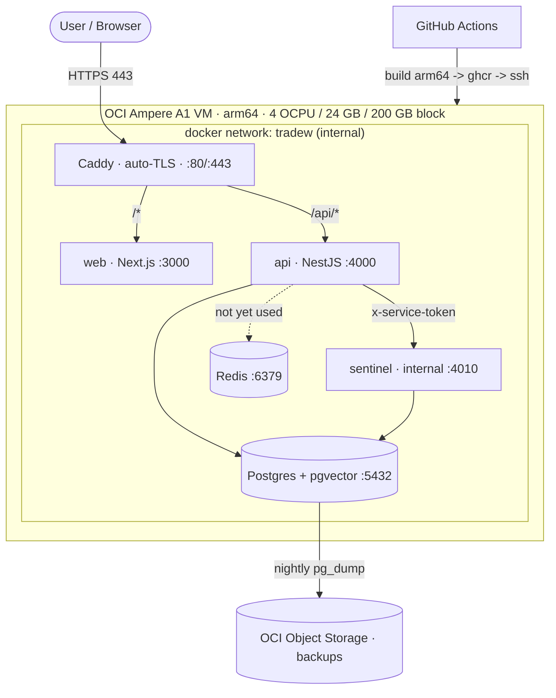

# TradeW on Oracle Cloud Free Tier — Deployment Architecture

Oracle Cloud is the **hosting platform only**. The application is unchanged:
PostgreSQL remains the sole database (via Prisma + pgvector). Nothing here
migrates data to Oracle Database. This document is the deployment design; the
runnable artifacts live in `infra/docker/` and `.github/workflows/deploy.yml`.

> ⚠️ **Not validated in a live OCI environment.** These configs are designed
> to be correct and compose-validated, but no OCI VM was available to test an
> end-to-end deploy or an arm64 image build. First deploy is the validation.

## Topology

Only Caddy is published (80/443). `web`, `api`, `sentinel`, `postgres`,
`redis` are reachable only on the internal Docker network — the same
single-public-ingress posture the app already assumes (`ARCHITECTURE.md`).

## 1. OCI Free Tier resources used

| Resource | Always Free allowance | This deployment |
|---|---|---|
| Compute — **Ampere A1 (arm64)** | 4 OCPU + 24 GB RAM total | 1 VM using the whole allocation |
| Block storage | 200 GB total | Boot + a data volume for `pgdata` |
| Object storage | 10 GB standard + 10 GB archive | DB backups |
| Egress | 10 TB/month | ample |
| VCN + public IP | 1 VCN, 1 ephemeral/reserved IP | the VM |
| Monitoring / Notifications / Alarms | included | host + alarm rules |

Deliberately **not** used: OCI Load Balancer (Caddy on the VM is simpler and
avoids the 10 Mbps free-LB cap), and Autonomous Database (that's Oracle DB — we
keep Postgres). AMD micro VMs (1 GB RAM) are too small for this stack.

> **arm64 is the load-bearing constraint.** Ampere is ARM. Every image must be
> arm64: the base images used here (`caddy`, `pgvector/pgvector:pg16`,
> `redis:7-alpine`, `node:20-bookworm-slim`) all publish multi-arch manifests,
> and CI builds the app images for `linux/arm64`. If `pgvector/pgvector:pg16`
> ever fails to pull on arm64, fall back to `postgres:16` + build the extension.

## 2. VM

- **Shape:** `VM.Standard.A1.Flex`, 4 OCPU / 24 GB. **OS:** Ubuntu 22.04 (arm64)
  or Oracle Linux 9.
- **Storage:** default ~47 GB boot; attach a **paravirtualized block volume**
  (e.g. 100 GB) mounted at `/opt/tradew/data` for the `pgdata` bind/volume, so
  the database survives instance rebuilds and can be OCI-snapshotted.
- Install: Docker Engine + compose plugin, git, rclone. Clone the repo to
  `/opt/tradew`.

## 3. Networking & security (the #1 OCI gotcha)

OCI blocks traffic in **two** places — you must open ports in **both** or it
looks "up" but is unreachable:

1. **VCN Security List / NSG** (cloud firewall): ingress rules for
   TCP **80** and **443** from `0.0.0.0/0`; keep **22** restricted to your IP.
2. **Instance firewall** (Ubuntu ships `iptables`, Oracle Linux `firewalld`):
   OCI images add default-deny rules. Open 80/443 there too, e.g.
   `sudo iptables -I INPUT 6 -m state --state NEW -p tcp --dport 443 -j ACCEPT`
   (and 80), then persist with `netfilter-persistent save` — or use `ufw`.

Do **not** expose 4000/4010/5432/6379 — they stay on the Docker network.

## 4. Docker deployment

Everything is `infra/docker/docker-compose.prod.yml` (compose-validated). One
VM, one `docker compose up -d`. Images are pulled from GHCR in production
(`IMAGE_*` in `.env.prod`); the same file can `build` locally on the VM as a
fallback. Restart policy `unless-stopped` + healthchecks give self-healing.
The `migrate` service runs `prisma migrate deploy` once and exits before the
app starts (`depends_on: service_completed_successfully`).

## 5. PostgreSQL

- `pgvector/pgvector:pg16`, data on the block-volume-backed `pgdata` volume.
- Tuned for 24 GB (`shared_buffers=1GB`, `effective_cache_size=3GB`) — leaves
  headroom for the Node services. Adjust after observing real usage.
- Not published; only `api`/`sentinel` on the internal network reach it.
- The pgvector extension is created by the existing migration
  (`CREATE EXTENSION vector`) — no manual DB setup beyond running migrations.

## 6. Redis

Provisioned (`redis:7-alpine`, AOF persistence, internal only) but **not yet
consumed by application code** — no Redis client is wired in the app today. It
is here ready for sessions / caching / job queues when those are built; until
then it idles. Honest status, not load-bearing.

## 7. Reverse proxy + SSL

- **Caddy** (`infra/docker/Caddyfile`): automatic HTTPS via Let's Encrypt, near
  zero config. `handle_path /api/*` strips the prefix and forwards to the API
  (same-origin → no CORS); everything else → the Next app. SSE (Knowledge
  Workspace stream) is passed through unbuffered.
- **Prerequisite:** a domain with a DNS **A record → the VM public IP**, and
  ports 80+443 open (§3). Let's Encrypt's HTTP-01 challenge needs port 80.
- Certs persist in the `caddy-data` volume across restarts.
- *Alternative:* Nginx + certbot — more moving parts; Caddy chosen for Free-Tier simplicity.

## 8. Backups

`infra/docker/backup.sh`: nightly `pg_dump | gzip` → OCI Object Storage via
rclone (S3-compatible remote), with `BACKUP_RETENTION_DAYS` pruning. Cron at
02:30. Restore is documented in the script header (gunzip → `psql`). Optionally
also enable **OCI block-volume backup policies** (bronze/silver) for
volume-level snapshots — belt and suspenders.

## 9. Monitoring

Layered, RAM-budget-conscious (keep the 24 GB for the app):

- **OCI native (free, no containers):** Compute agent metrics (CPU/mem/disk) +
  **Alarms → Notifications** (email/Slack) on thresholds. Best value on Free Tier.
- **Container self-healing:** healthchecks on api/sentinel/postgres/redis +
  `restart: unless-stopped`. The app already exposes `/health` on api and sentinel.
- **Optional light uptime:** add **Uptime Kuma** (one small container) hitting
  `https://DOMAIN` and `/api/health`.
- **Optional deep metrics:** Prometheus + Grafana + node-exporter + cAdvisor
  (~1–2 GB RAM). Fits in 24 GB but adds ops — add only if needed.

## 10. CI/CD

`.github/workflows/deploy.yml`: on push to `main`, matrix-build web/api/sentinel
for **linux/arm64** (QEMU + buildx, gha cache), push to **ghcr.io**, then SSH to
the VM to `git pull`, `compose pull`, run `migrate`, `compose up -d`.

Repo secrets required: `SSH_HOST`, `SSH_USER`, `SSH_KEY` (GHCR uses the built-in
`GITHUB_TOKEN`). Images: `ghcr.io/<owner>/tradew-{web,api,sentinel}`.

## First deploy (checklist)

1. Provision the Ampere A1 VM (Ubuntu 22.04 arm64); attach + mount the data volume.
2. Open 80/443 in the VCN Security List **and** the instance firewall (§3).
3. Point DNS A record at the VM IP.
4. Install Docker + compose + git + rclone; `git clone` to `/opt/tradew`.
5. `cp infra/docker/.env.prod.example .env.prod`; fill in DOMAIN, ACME_EMAIL,
   and **rotate every secret** (`JWT_SECRET`, DB password, `SERVICE_TOKEN` ==
   `SENTINEL_SERVICE_TOKEN`). Point `IMAGE_*` at your GHCR.
6. Configure the rclone OCI remote + backup bucket; add the backup cron.
7. First run: `docker compose -f infra/docker/docker-compose.prod.yml --env-file .env.prod up -d`
   (or push to `main` and let CI deploy). Verify `https://DOMAIN` and
   `https://DOMAIN/api/health`.

## Risks / limits requiring a decision

- **arm64 image builds** are unvalidated here — the first CI build is the proof.
- **Ampere A1 capacity:** the free shape is popular and OCI sometimes returns
  "out of host capacity" in a region — may need retries or a different AD/region.
- **Single VM = single point of failure.** Free Tier has no HA. Acceptable for
  a prototype; note it before production traffic.
- **`next start` image is large** (full node_modules). Optimize later with Next
  `output: 'standalone'` (a one-line app-config change, deferred to avoid
  touching app config now).
- **Which frontend to serve:** this design serves `apps/web` (Next). The static
  `apps/terminal` prototype can additionally be served by Caddy as static files
  if desired — confirm intent.
