# TradeW Platform Audit & Implementation Roadmap

## For future Claude
Read this before re-auditing the platform from scratch, or before assuming any `services/*` folder besides `api` and `sentinel` has real code — most don't. This is the canonical, verified snapshot of the whole platform as of 2026-07-17: every REST endpoint, every guard, every env var, every DB table, every module's production-readiness rating, and the prioritized build order. Link here before starting new platform work; update this note (don't create a parallel one) when the picture changes materially. Companion notes: [[../Decisions/2026-07-17 - Obsidian Knowledge Layer adopted]], [[../Research/2026-07-17 - Sentinel Brain audit]].

## Executive Summary

TradeW today is **two real backend services and one real frontend**, plus a large amount of well-written *placeholder* documentation describing services that don't exist as code yet. This is not a red flag by itself — `services/auth`'s README explicitly documents the in-process-module choice as deliberate, and the monorepo's own naming makes the gap obvious rather than hiding it. The core loop that exists — signup/login → JWT → `services/api` → `services/sentinel` (Persistent Knowledge Brain, fully implemented per the Phase 1 audit) → observations back to the user — works end to end in code, has never been run end to end against a live database in this environment, and has zero automated tests anywhere in the repo (`0` `.spec.ts`/`.test.ts` files found, confirmed by direct glob).

The three biggest risks are not "missing features" — they're a documentation/reality gap that could waste future engineering time (`packages/shared`'s "fail-fast config validation" is a README claim, not code; the referenced `infra/docker` compose file didn't exist until this session), a resilience gap that was just fixed in this session (`/brain/*` and `/observations` 500'd on DB outage instead of degrading like every other Brain service), and zero test coverage on the parts of the system that touch money and auth.

## 1. Current Architecture (verified, not aspirational)

```mermaid
graph TD
  subgraph Frontend
    web[apps/web — Next.js]
    terminal[apps/terminal — static demo, client-side heartbeat]
  end
  subgraph Backend
    api[services/api :4000 — NestJS, single public ingress]
    sentinel[services/sentinel :4010 — NestJS, internal-only]
  end
  subgraph Data
    pg[(Postgres + pgvector\nshared schema)]
  end
  subgraph External AI providers
    anthropic[Anthropic]
    voyage[Voyage]
    tavily[Tavily / Brave / Firecrawl]
  end
  web -->|JWT| api
  terminal -->|JWT, client setInterval poll| api
  api -->|x-service-token| sentinel
  api --> pg
  sentinel --> pg
  sentinel -.->|optional, key-gated| anthropic
  sentinel -.->|optional, key-gated| voyage
  sentinel -.->|optional, key-gated| tavily

  placeholder[services/auth, analytics, market-data,\nnotification, trading-engine, tradew-ai\n— README only, no code]
  style placeholder fill:#333,stroke:#900,stroke-dasharray: 5 5
```

## 2. Service Dependency Graph (runtime)

- `apps/web` → `services/api` only, via `NEXT_PUBLIC_API_URL` (`apps/web/src/lib/api.ts:1`).
- `apps/terminal` → `services/api` only, via a client-side `setInterval` heartbeat (see §Runtime Dependency Graph).
- `services/api` → `services/sentinel`, via `SENTINEL_SERVICE_URL` + `x-service-token` header (`services/api/src/sentinel/sentinel.service.ts`). This is the **only** internal service-to-service HTTP call in the entire codebase.
- `services/sentinel` → no internal TradeW service. Only outbound calls are to external AI providers, all optional and key-gated (`packages/ai-core/src/providers/factory.ts`).
- No other service participates — `trading-engine`, `market-data`, `notification`, `analytics`, `tradew-ai`, `auth` have no code to call.

## 3. Complete REST Endpoint Inventory

**34 endpoints total. Zero Swagger/OpenAPI anywhere** (confirmed: no `@nestjs/swagger` dependency in either service's `package.json`, no `SwaggerModule` reference repo-wide).

### services/api — port 4000, no global prefix (27 endpoints)

| Method | Path | Guards | File:line |
|---|---|---|---|
| POST | `/auth/signup` | none | `auth.controller.ts:47` |
| POST | `/auth/login` | none | `auth.controller.ts:50` |
| POST | `/auth/refresh` | none | `auth.controller.ts:53` |
| POST | `/auth/logout` | AuthGuard | `auth.controller.ts:57` |
| GET | `/auth/me` | AuthGuard | `auth.controller.ts:61` |
| PATCH | `/auth/me` | AuthGuard | `auth.controller.ts:65` |
| GET | `/auth/preferences` | AuthGuard | `auth.controller.ts:69` |
| POST | `/auth/preferences/:key` | AuthGuard | `auth.controller.ts:73` |
| GET | `/entitlements/me` | AuthGuard | `entitlements.controller.ts:36` |
| GET | `/entitlements/me/check/:capability` | AuthGuard | `entitlements.controller.ts:42` |
| GET | `/entitlements/plans` | none | `entitlements.controller.ts:47` |
| POST | `/entitlements/admin/subscriptions` | AdminTokenGuard | `entitlements.controller.ts:57` |
| POST | `/entitlements/admin/subscriptions/:id/cancel` | AdminTokenGuard | `entitlements.controller.ts:74` |
| POST | `/entitlements/admin/overrides` | AdminTokenGuard | `entitlements.controller.ts:80` |
| GET | `/entitlements/admin/users/:userId/capabilities` | AdminTokenGuard | `entitlements.controller.ts:103` |
| GET | `/health` | none | `health.controller.ts:5` |
| GET | `/instruments/search` | AuthGuard | `instruments.controller.ts:10` |
| GET | `/market-data/quote/:instrumentId` | AuthGuard | `market-data.controller.ts:10` |
| POST | `/sentinel/observe` | AuthGuard, CapabilityGuard(`sentinel`) | `sentinel.controller.ts:23` |
| POST | `/sentinel/explain` | AuthGuard, CapabilityGuard(`sentinel`) | `sentinel.controller.ts:48` |
| POST | `/sentinel/brain/search` | AuthGuard, CapabilityGuard(`sentinel`) | `sentinel.controller.ts:56` |
| GET | `/sentinel/brain/strategy` | AuthGuard, CapabilityGuard(`sentinel`) | `sentinel.controller.ts:64` |
| GET | `/sentinel/observations` | AuthGuard, CapabilityGuard(`sentinel`) | `sentinel.controller.ts:69` |
| GET | `/sentinel/session-summary` | AuthGuard, CapabilityGuard(`sentinel`) | `sentinel.controller.ts:74` |
| GET | `/sentinel/journal` | AuthGuard, CapabilityGuard(`sentinel`) | `sentinel.controller.ts:79` |
| POST | `/sentinel/journal` | AuthGuard, CapabilityGuard(`sentinel`) | `sentinel.controller.ts:84` |
| POST | `/sim/orders` | AuthGuard | `sim.controller.ts:24` |
| GET | `/sim/positions` | AuthGuard | `sim.controller.ts:29` |

### services/sentinel — port 4010, internal-only, no global prefix (7 endpoints)

| Method | Path | Guards | File:line |
|---|---|---|---|
| GET | `/health` | none | `app.controller.ts:46` |
| POST | `/observe` | ServiceTokenGuard | `app.controller.ts:53` |
| GET | `/observations` | ServiceTokenGuard | `app.controller.ts:60` |
| POST | `/explain` | ServiceTokenGuard | `app.controller.ts:67` |
| POST | `/brain/search` | ServiceTokenGuard | `app.controller.ts:74` |
| GET | `/brain/stats` | ServiceTokenGuard | `app.controller.ts:80` |
| GET | `/brain/strategy` | ServiceTokenGuard | `app.controller.ts:87` |

No endpoints exist anywhere else (`apps/admin`, `apps/mobile`, `apps/terminal` are all endpoint-free; `apps/web` has no `route.ts` API routes; the other six `services/*` folders have no source).

## 4. Authentication & Authorization Matrix

Two independent auth mechanisms, one per trust boundary — no OAuth/Clerk/Auth0/session-cookie auth anywhere.

| Boundary | Mechanism | Implementation | Notes |
|---|---|---|---|
| End user → `services/api` | JWT bearer token | `services/api/src/auth/auth.guard.ts` — `Authorization: Bearer <token>`, verified via `@nestjs/jwt` `JwtService.verify()` against `JWT_SECRET` (default `dev-secret-change-me` if unset — **weak default, see Security Findings**) | Access token 15min TTL (`ACCESS_TOKEN_TTL`), rotating hashed (SHA-256) refresh tokens stored in `RefreshToken` table, 30-day TTL (`REFRESH_TOKEN_DAYS`). Passwords bcrypt-hashed (cost 10). |
| `services/api` → `services/sentinel` | Static shared secret | `services/sentinel/src/app.controller.ts:26-33` `ServiceTokenGuard` — header `x-service-token` must equal `SERVICE_TOKEN` env var exactly | No rotation, no expiry — a leaked token is valid forever until manually changed. Sentinel is not internet-exposed by design (binds to `127.0.0.1` by default) so this is a reasonable internal-network control, not a public API key. |
| Admin operator → `services/api` `/entitlements/admin/*` | Static shared secret | `entitlements.controller.ts:19-27` `AdminTokenGuard` — header vs `ADMIN_API_TOKEN`; **entire admin API is disabled if this env var is unset** (fail-closed by omission, which is good) | No per-admin identity, no audit trail distinguishing which admin did what — every admin call looks identical in logs. |
| — | Role-based access control (RBAC) | **Not implemented.** | No `Role`/`Permission` model, no `@Roles()` decorator anywhere. |
| — | Authorization | Entitlement/capability-based, not role-based | `CapabilityGuard` + `EntitlementsService` (`services/api/src/entitlements/`) — checks a user's `Plan`/`Subscription`/`EntitlementOverride`/`UsageCounter` rows for a named capability (e.g. `'sentinel'`) and enforces quota. This is a billing/plan gate, not a permissions system — there's no concept of "moderator" or "support staff" role today. |

**Open endpoints (no auth at all):** `/auth/signup`, `/auth/login`, `/auth/refresh` (correct — these issue the credential), `/entitlements/plans` (correct — public pricing info), `GET /health` on both services (correct — health checks shouldn't require auth).

## 5. Database Ownership Map

Single Prisma schema (`packages/database/prisma/schema.prisma`), single shared Postgres instance, **21 models**, each service touching only its own tables in code (verified by grep — no cross-ownership violations found):

| Owner | Tables |
|---|---|
| `services/api` | `User`, `RefreshToken`, `UserPreference`, `AuditEvent`, `Instrument`, `Quote`, `Order`, `Trade`, `Position`, `Plan`, `PlanGrant`, `Subscription`, `EntitlementOverride`, `UsageCounter`, `JournalEntry` |
| `services/sentinel` | `SentinelObservation`, and `MemoryRecord`/`MemoryRelation`/`GraphNode`/`GraphEdge` scoped to the `'sentinel'` namespace (shared table, namespace-partitioned — other future services could use the same Memory/Graph tables under their own namespace without conflict) |
| Neither (schema exists, unused in code) | `NewsEvent` — model defined in the migration, no service currently reads/writes it (`packages/ai-core/src/news/news-event-classifier.ts` classifies news in-memory but doesn't persist to this table — worth confirming intent before building on it) |

`services/sentinel/src/prisma.service.ts:4-9` documents this boundary explicitly in a code comment: Sentinel "NEVER touches trading tables... services/api passes trade summaries per request" — verified true in `SentinelApiService.observe()`, which reads `Trade`/`Position` itself and forwards summaries.

## 6. Environment Variable Classification

Full detail (all variables, defaults, required/optional, doc gaps) is in the audit-agent output already synthesized into this report; the load-bearing subset:

**Actually required (no safe default, will break something if missing):**
- `DATABASE_URL` — both services. Prisma throws at client construction if entirely unset (before either service's fault-tolerant `try/catch` connect logic even runs). A wrong-but-present URL degrades gracefully; a missing one does not.
- `SERVICE_TOKEN` (Sentinel) / `SENTINEL_SERVICE_TOKEN` (api, must match) — without it, every guarded Sentinel route 401s.
- `JWT_SECRET` — has a default (`dev-secret-change-me`) so it won't crash, but using the default in anything beyond local dev is a security hole (see below).

**Optional, safe defaults:** `PORT`, `HOST`, `FRONTEND_URL`, `CORS_ORIGINS`, `SENTINEL_SERVICE_URL`, `ADMIN_API_TOKEN` (unset = admin API disabled, which is the safe direction), `ACCESS_TOKEN_TTL`, `REFRESH_TOKEN_DAYS`, all AI provider keys (`ANTHROPIC_API_KEY`, `VOYAGE_API_KEY`, `TAVILY_API_KEY`, `BRAVE_API_KEY`, `FIRECRAWL_API_KEY`, `OPENAI_API_KEY`, `NVIDIA_NIM_API_KEY`/`NVIDIA_NIM_BASE_URL`, `OLLAMA_BASE_URL`) — none registered if absent, Brain degrades to text search / deterministic composition.

**Documentation gaps** (read via `process.env` in code but absent from `.env.example`, all with safe code-level defaults so functional but undocumented): `REFRESH_TOKEN_DAYS`, `ACCESS_TOKEN_TTL` (services/api); `CORS_ORIGINS`, `OPENAI_EMBEDDING_MODEL`, `NVIDIA_NIM_EMBEDDING_MODEL`, `VOYAGE_MODEL` (services/sentinel).

## 7. External Dependency Inventory

| Dependency | Purpose | Required? |
|---|---|---|
| PostgreSQL 16 + pgvector extension | Primary datastore, vector similarity search | Yes — single point of failure for all persistence |
| Anthropic API | LLM completions (Sentinel Brain reasoning, summarization) | No — optional, degrades to deterministic text |
| Voyage API | Embeddings (semantic search quality) | No — degrades to `ILIKE` text match |
| NVIDIA NIM | Alternate LLM/embedding provider (hosted or self-hosted) | No |
| OpenAI | Alternate LLM/embedding provider | No |
| Ollama | Local LLM provider | No |
| Tavily / Brave / Firecrawl | Research providers (Continuous Research Engine) | No — research trigger silently no-ops without one |
| Docker Desktop (dev only) | Local Postgres+pgvector container | Dev-environment only, not a runtime dependency |

No Redis, no message queue, no object storage, no email/SMS provider found anywhere in code despite being referenced in planning docs (`infra/docker/README.md` mentions `redis` as a target, not yet added).

## 8. Runtime Dependency Graph / Startup Order

1. **Postgres** — must have `DATABASE_URL` set as an env var for both services to boot cleanly (Prisma client construction fails on total absence); actual DB *reachability* is optional at boot (both services degrade gracefully on connection failure, not absence).
2. **`services/sentinel`** — boots regardless of DB/provider state; needs `SERVICE_TOKEN` set to be *callable* (not to *boot*).
3. **`services/api`** — needs `SENTINEL_SERVICE_URL` + `SENTINEL_SERVICE_TOKEN` (matching step 2) to reach Sentinel; needs `JWT_SECRET`/`DATABASE_URL` for its own features. A Sentinel-unreachable state doesn't crash `services/api` — it returns `502 BadGatewayException` per-request.
4. **`apps/web`** — needs `NEXT_PUBLIC_API_URL` pointing at step 3.

No other service participates in boot order today (see §2).

## 9. Failure Mode Analysis

| Failure | Effect | Verified behavior |
|---|---|---|
| Postgres unreachable, `DATABASE_URL` set | `services/api` and `services/sentinel` both boot; `PrismaService.onModuleInit` catches the connect error and logs a warning | Graceful |
| `DATABASE_URL` entirely unset | Both services likely crash at Prisma client construction, before their own try/catch runs | **Not graceful** — undocumented, worth an explicit startup check with a clear error message instead of a raw Prisma stack trace |
| Sentinel unreachable from `services/api` | Every `/sentinel/*` route in `services/api` returns `502 Sentinel service unreachable` | Graceful, well-handled (`BadGatewayException` in `sentinel.service.ts`) |
| `SERVICE_TOKEN` mismatch/missing | Sentinel 401s the guarded route; `services/api` surfaces this as a 502 (status-check on `res.ok`, not the actual 401) | Functionally graceful, but the 502 masks the real cause (auth misconfig looks identical to "Sentinel is down" from the caller's perspective) — a debuggability gap, not a correctness bug |
| DB down mid-request to `/brain/search`, `/brain/stats`, `/observations` (Sentinel) | **Fixed this session** — previously threw an unhandled exception (500); now catches and returns an empty/zeroed result, matching every other Brain service's posture | Graceful (as of this report) |
| DB down mid-request to `/observe` | Already graceful — Pattern Recognition, Market Context, Outcome Learning, Historical Similarity, Strategy Intelligence all individually try/catch and degrade | Graceful (was already correct) |
| AI provider key missing/invalid | Provider simply isn't registered (missing key) or the specific call fails and is caught (invalid key, e.g. embedding failure in `PrismaMemoryStore.store()`) | Graceful |
| Client-side heartbeat (`apps/terminal`) with no tab open | Nothing runs — outcome evaluation and research triggers ride the `/observe` cadence with no server-side fallback scheduler | **By design, but a real gap** — pattern occurrences never get outcome-evaluated if no user has the terminal open during market hours; this directly limits how much Strategy Intelligence data can accumulate |

## 10. Security Findings

Ranked by severity; none of these are exploited/exploitable-today issues in a local dev environment, but all matter before any non-local exposure.

1. **🔴 Weak/default secrets fall back silently.** `JWT_SECRET` defaults to `'dev-secret-change-me'`, `SERVICE_TOKEN`/`SENTINEL_SERVICE_TOKEN` default to `'dev-sentinel-token-change-me'` in `.env.example`. Nothing prevents deploying with these literal strings still in place — no startup check flags "you are using the example secret." This is the single highest-priority security fix before any shared/staging deployment.
2. **🔴 No rate limiting anywhere.** Grepped for `ThrottlerModule`, `helmet`, generic rate-limit packages — none found in either service. `/auth/login` and `/auth/signup` are open, unauthenticated, and unthrottled — brute-force and credential-stuffing are unmitigated today.
3. **🟡 No security headers middleware (`helmet` or equivalent).** Not found in either service's `main.ts` or dependencies.
4. **🟡 No CSRF protection**, but exposure is low today — the API is bearer-token (not cookie-session) authenticated, which is inherently CSRF-resistant; this would only matter if cookie-based auth is ever added.
5. **🟡 Admin auth has no identity, only a shared secret.** Every `/entitlements/admin/*` call is indistinguishable from any other in `AuditEvent`-style logging — there's no per-admin accountability.
6. **🟢 Password handling is correct.** bcrypt cost 10, no plaintext storage, refresh tokens stored as SHA-256 hashes (not plaintext), refresh token rotation on use (old token revoked, new one issued) — all sound patterns.
7. **🟢 Internal service isolation is reasonable.** Sentinel binds to `127.0.0.1` by default and documents itself as internal-only, reached exclusively via `services/api`'s shared-secret header — appropriate for the current single-tenant-per-deploy shape.
8. **🟡 CORS is permissive by convenience, not by mistake** — `services/sentinel`'s CORS comment explicitly says it's local-dev-only (`main.ts:6-8`) so the Terminal app can call it directly in dev; this must not ship as-is to any environment where Sentinel could be reachable from a browser.

## 11. Technical Debt Matrix

| Item | Type | Cost of leaving it |
|---|---|---|
| Zero test files anywhere (`0` `.spec.ts`/`.test.ts`, confirmed by glob) | Test coverage | High — every future change to auth, entitlements, or the Brain is unverified except by manual testing |
| `packages/shared` is a README with no code, despite `ARCHITECTURE.md §1.4` describing it as an implemented "fail-fast config validation loader" | Doc/code drift | Medium — a future engineer will trust the architecture doc and be surprised; already caught and corrected once this session for `infra/docker` |
| No Swagger/OpenAPI | Developer experience | Medium — every API consumer (mobile app, QA, third-party) has to read source to know the contract |
| `packages/sdk`, `packages/ui` are placeholders (no source) despite being listed as real workspaces in root `package.json` | Doc/code drift | Low today, will matter once `apps/mobile`/`apps/admin` start needing shared UI/SDK code |
| No `dev:sentinel` npm script at the workspace root (only `dev:api`/`dev:web` exist) | DX friction | Low — minor onboarding friction |
| `NewsEvent` table exists in the schema with no service writing to it | Schema/code drift | Low today — dead weight, will confuse whoever tries to query it expecting live data |
| Missing `.env.example` entries for 6 real env vars (see §6) | Documentation gap | Low — all have safe defaults, purely a discoverability issue |
| No structured logging/observability (no APM, no request tracing, only `console.log`/NestJS `Logger`) | Observability | Medium — will become a real problem once more than one engineer needs to debug production issues |

## 12. Production Readiness Matrix

| Module | Rating | Why |
|---|---|---|
| `services/api` — auth (signup/login/refresh/logout) | 🟡 Needs Hardening | Correct crypto/token design; missing rate limiting, weak default secret, zero tests |
| `services/api` — entitlements/billing | 🟡 Needs Hardening | Real quota/plan logic; zero tests; admin auth has no per-operator identity |
| `services/api` — sentinel gateway | 🟡 Needs Hardening | Correctly isolates Sentinel, handles unreachability gracefully; zero tests |
| `services/api` — sim (paper trading) | 🟡 Needs Hardening | Functional, unaudited in this pass (out of today's explicit scope) — flagged for a follow-up audit pass |
| `services/sentinel` — Persistent Knowledge Brain | 🟢 Production Ready (code) / 🟡 Needs Hardening (ops) | Fully implemented, defensively coded (per [[../Research/2026-07-17 - Sentinel Brain audit]]); never run against a live DB in this environment until Phase 2 completes; zero tests |
| `services/sentinel` — intelligence engines (market/emotion/trap/news) | 🟡 Needs Hardening | Real logic, not yet independently audited line-by-line this pass; zero tests |
| `services/sentinel` — compliance/audit trail | 🟡 Needs Hardening | Real, now degrades gracefully (fixed this session); no retention policy defined |
| `packages/ai-core` | 🟢 Production Ready (design) | Provider-agnostic, config-driven, defensively wrapped throughout; well-abstracted |
| `packages/database` (schema/migrations) | 🟢 Production Ready (design) / 🟡 (ops, unverified against live DB) | Correct, complete schema; migrations never applied to a live instance in this environment yet |
| `packages/shared` | 🔴 Prototype/Placeholder | README only, no code — despite being referenced elsewhere as implemented |
| `packages/sdk`, `packages/ui` | 🔴 Prototype/Placeholder | README only |
| `packages/types` | 🟢 Production Ready | Real, compiled, used by both services |
| `apps/web` | 🟡 Needs Hardening | Real Next.js app, not deeply audited this pass |
| `apps/terminal` | 🟡 Needs Hardening | Functional static demo; entire "heartbeat" depends on a browser tab being open — a real product gap, not just a hardening gap |
| `apps/admin`, `apps/mobile` | 🔴 Prototype/Placeholder | README only |
| `services/auth` (standalone) | 🔴 Prototype/Placeholder (deliberately) | Documented, intentional deferral — not a gap, a decision |
| `services/analytics`, `market-data`, `notification`, `trading-engine`, `tradew-ai` | 🔴 Prototype/Placeholder | README only, no code |

## 13. Recommended Build Order

Preserve existing working code; only extend. Ordered by (a) unblocking further work, (b) risk reduction, (c) product value — in that priority order.

1. **Testing foundation** — before adding more surface area, put a test harness in place (Jest is already implied by NestJS's default tooling) covering at minimum: auth (signup/login/refresh/token-expiry), entitlements (capability checks, quota), and the Brain's degrade-on-DB-failure paths (now easy to test since this session's fix). Zero tests today means every subsequent sprint compounds risk.
2. **Security hardening** (§10 items 1-2 first: secret validation at boot, rate limiting on `/auth/*`) — cheap, high-value, blocks nothing else.
3. **Complete Phase 2 infra validation** (Docker/WSL now fixed per your update) — actually run migrations against a live Postgres, verify the full save→retrieve→search→graph path, confirm the fixes in this report work under real conditions. This was blocked earlier this session; now unblocked.
4. **Sentinel: server-side outcome evaluation** — replace (or supplement) the client-heartbeat-only trigger for `OutcomeLearningService`/`ResearchTriggerService` with a real scheduler (`@nestjs/schedule` `@Interval`), so Strategy Intelligence data accumulates even without a browser tab open. This is the most product-relevant gap in the Brain today — directly limits how useful Historical Similarity / Strategy Intelligence become over time.
5. **Swagger/OpenAPI on `services/api`** — cheap, unblocks faster frontend/mobile iteration and any future third-party integration.
6. **`packages/shared`'s actual config-validation loader** — make the `ARCHITECTURE.md` claim true; directly prevents the "deployed with `dev-secret-change-me`" risk from §10.
7. **Sentinel multi-agent expansion** (per your stated direction — treat Sentinel as the premium intelligence layer, build toward the planned multi-agent system) — Portfolio Intelligence (still ❌ per [[../Research/2026-07-17 - Sentinel Brain audit]]) is the next unbuilt Brain subsystem; natural next addition once the scheduler (item 4) exists to feed it continuously.
8. **Extract `services/auth`** — explicitly NOT recommended yet; the README's own trigger condition (approaching 50k concurrent sessions) hasn't been met. Revisit only when that's true.

## 14. Sprint-by-Sprint Implementation Plan

**Sprint 1 — Foundation (test harness + security hardening + Phase 2 infra validation).** Deliverables: Jest configured in both services with CI-runnable auth/entitlements/Brain-degradation tests; a boot-time check that rejects known example secrets (`dev-secret-change-me`, `dev-sentinel-token-change-me`) outside a `NODE_ENV=development` guard; `@nestjs/throttler` on `/auth/login`, `/auth/signup`, `/auth/refresh`; Docker Postgres+pgvector actually running with migrations applied and the full Brain path (save→retrieve→search→graph, `/observe`, `/brain/*`) verified live.

**Sprint 2 — Sentinel scheduler + Swagger.** Deliverables: `@nestjs/schedule` added to `services/sentinel`, `OutcomeLearningService.evaluatePending()` and `ResearchTriggerService` given a real interval trigger independent of `/observe` traffic (keep the existing opportunistic trigger too — additive, not a replacement, per "preserve existing working code"); `@nestjs/swagger` added to `services/api` with `DocumentBuilder`/`SwaggerModule.setup('/api/docs', ...)`.

**Sprint 3 — `packages/shared` config validation + observability baseline.** Deliverables: a real zod-or-similar env schema per service, validated at `bootstrap()` before `NestFactory.create`, failing fast with a clear message (matches the already-written `ARCHITECTURE.md` claim); structured logging (pino or NestJS's built-in JSON logger) replacing raw `console.log`/`Logger` text output, so logs are machine-parseable when a real log aggregator is added later.

**Sprint 4 — Portfolio Intelligence (Sentinel Brain's last unbuilt subsystem).** Cross-position risk analysis, feeding off the now-scheduler-driven outcome/pattern data from Sprint 2. Must stay observation-only per your constraints — no buy/sell/entry/exit language, ever.

**Sprint 5+ — revisit based on what Sprint 1-4 surfaces.** Don't pre-plan further than this; the testing foundation from Sprint 1 will likely surface issues that reorder priorities.

## 15. Immediate Next Tasks (code-level)

**Done this session (small, safe, matches existing patterns exactly — no architecture change):**
- ✅ `KnowledgeCenterService.search()`/`stats()` now degrade gracefully on DB failure (`services/sentinel/src/brain/knowledge-center.service.ts`), matching the try/catch-and-degrade pattern already used by `HistoricalSimilarityService`, `MarketContextService`, `OutcomeLearningService`, `PatternRecognitionService`, `ResearchTriggerService`, `StrategyIntelligenceService`.
- ✅ `ComplianceService.feed()` (backs `/observations`) — same fix, same reasoning.
- ✅ Type-checked clean (`tsc --noEmit`) after both edits.

**Not started — each is independently startable, listed smallest-first:**
1. Add `dev:sentinel` script to root `package.json` (1-line fix, pure DX).
2. Add `.env.example` entries for the 6 documented-but-missing env vars (§6).
3. `@nestjs/throttler` on the three open auth endpoints.
4. Boot-time secret validation (reject example secrets outside dev).
5. `@nestjs/schedule` for Sentinel's outcome/research triggers.
6. `@nestjs/swagger` on `services/api`.
7. Test harness setup (Jest config + first auth test) — largest of this list, but highest-leverage.

## Related
- [[../Research/2026-07-17 - Sentinel Brain audit]]
- [[../Decisions/2026-07-17 - Obsidian Knowledge Layer adopted]]
- [[../_INDEX.md]]
